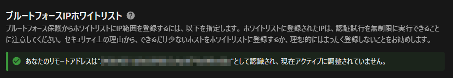

# 🚀 Simple Nextcloud with Docker
NextcloudをDocker Compose + CFTunnelで簡単に構築

このリポジトリは、Docker Compose を使って簡単に Nextcloud をデプロイできるセットアップです  
Cloudflare Tunnel を利用した安全な外部公開にも対応しています

---

## 📦 セットアップ手順

### 1. リポジトリをクローン

```bash
git clone https://github.com/kuwacom/Nextcloud-with-Docker.git
cd Nextcloud-with-Docker
```

### 2. `.env` ファイルを作成して設定
以下の内容を `.env` ファイルとしてルートディレクトリに作成し、自分の環境に合わせて編集してください

```conf
# Nextcloudの設定
NEXTCLOUD_VERSION=30                                        # 使用したいNextcloudのバージョン 30が最新(2025/04/20現在)
HTTP_PORT=80                                                # Nextcloudを公開するポート
NEXTCLOUD_TRUSTED_DOMAINS=nextcloud localhost <your_domain> # 信頼するドメイン (スペース区切りで複数指定可能)
ADMIN_USERNAME=<admin_user_name>                            # Nextcloudの管理者ユーザー名
ADMIN_PASSWORD=<your_password>                              # Nextcloudの管理者パスワード
DEFAULT_LANGUAGE=ja                                         # デフォルトの言語 (例: ja, en)

# CloudFlareの設定
CLOUDFLARE_TUNNEL_TOKEN=<your_cloudflare_tunnel_token>      # CloudFlareのトンネルトークン
```

### 3. コンテナの起動
```
docker compose up -d
```

### 4. 動作確認
ブラウザで http://localhost:<HTTP_PORT> にアクセスし、Nextcloudの案内が表示されれば成功です

## 🌐 Cloudflare Tunnel で公開する
Cloudflare Tunnel を利用することで、外部ネットワークから安全にNextcloudへ接続できるようになります

> **⚠️注意⚠️**  
**Cloudflareにはアップロード及びダウンロードサイズ制限があるので、的確に設定しない場合、巨大ファイルのアップロードやダウンロード時にエラーが出る場合があります**  
**この手順は Cloudflare ダッシュボード側で設定を行うことを前提としています。**

### 1. Cloudflare Tunnel の作成
1. [Cloudflare Zero Trust ダッシュボード](https://one.dash.cloudflare.com/) にアクセス
2. **Network → Tunnels** から **Create a Tunnel** を選択
3. 任意の名前を入力し、トンネルを作成

### 2. 公開するサービスの設定
トンネル作成後、以下のようにエンドポイントを追加してください。

| サービス名      | エンドポイント（例）           | 宛先アドレス             |
| -------------- | -------------------------- | ---------------------- |
| **Nextcloud**  | `https://cloud.example.com` | `http://nextcloud:80`   |

設定完了後、Cloudflare Tunnel が正しく動作するか確認してください

## リバースプロキシ下でリモートIPを正しく反映させる
nginxやCloudFlare Tunnel下でNextCloudを利用する際、デフォルトの設定だと送信元IP(リモートIP)が取得できずに、リバースプロキシの立っているマシンやインスタンスのIPになってしまいます

この状態だとブルートフォースの制限やログ等が正常に行われずセキュリティ的にもよろしくないため、NextCloudのconfigを変更する必要があります

### 設定方法
まずは、事前に本docker composeを使ってNextCloudの構築を済ませてください

その後 `nextcloud/config/config.php` の `$CONFIG = array(` 内の一番下に以下の設定を追加しましょう

```php
  'trusted_proxies' =>
  array(
    0 => '127.0.0.1',
  ),
  'forwarded_for_headers' =>
  array(
    0 => 'HTTP_CF_CONNECTING_IP',
    1 => 'HTTP_X_FORWARDED_FOR',
  ),
```

この設定では、`127.0.0.1`からのアクセスをプロキシとして信頼し、リバースプロキシ前のリモートIPが記述してあるヘッダーを指定しています

`forwarded_for_headers`に関しては、利用するリバースプロキシによっては違うこともありますので、事前に確認をしてください

### 確認方法
ブラウザでNextCloudにログイン後、管理者設定 > セキュリティ の順にて確認可能です  
以下に自分の接続してるグローバルIPもしくはローカルIPが表示されていれば成功です！



---
以上！このドキュメントを参考にして、Docker Compose + Cloudflare Tunnel を活用した Nextcloud を楽しみましょう！

---
# 番外編

## NextCloudのバージョンアップ方法
NextCloudでは、定期的に最新バージョンへのアップグレードが推奨されています

本リポジトリでは、アップグレードも完結に行えるようにしてあります
### 1. コンテナの削除
まずは、一度コンテナ及びボリュームを削除します

以下のコマンドを実行してコンテナ及びボリュームを削除してください
```bash
sudo bash delete.sh
```
### 2. NextCloudイメージのバージョンを変更
次に、`.env`内にある`NEXTCLOUD_VERSION`で指定しているNextCloudのバージョンを新しいものにします

> **⚠️注意⚠️**  
**2個以上メジャーアップデートをまたいで更新はできないので、長い間アップデートしていない場合は一個一個更新していく必要があります**  
`nextcloud:27` -> `nextcloud:30` これは✖  
`nextcloud:27` -> `nextcloud:28`  -> `nextcloud:29` -> `nextcloud:30`

### 3. NextCloudの起動とアップグレード
次に、一度NextCloudを通常通り起動させます  
`docker compose up` もしくは `start.sh` 等をご利用ください

コンテナが完全に起動して、NextCloudのインストールが終了したことを確認出来たら、次にアップグレードスクリプトを実行します  
以下を実行することで自動でアップデートをすることができます  
こちらはホスト側で実行をしてください

```bash
sudo bash upgrade-nextcloud.sh
```